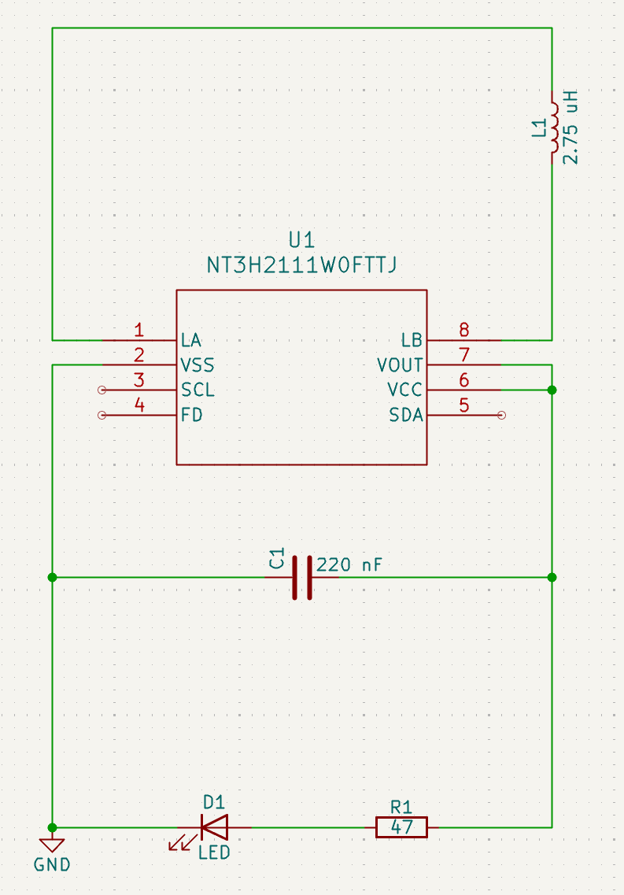

# PCB Business Card

A custom PCB card designed in KiCad, inspired by similar work done by [MarkWuElectronics](https://www.flux.ai/markwuflux).

## Features
- Custom PCB artwork and silkscreen
- NFC-tag with programmable functionality

## Project Images

I had these manufactured by JLCPCB for low cost and fast shipping.

## Files Included
- Schematic files and PCB files for KiCad
- Gerbers
- Images of the process

## License
This project is open-source and available under the MIT License.
